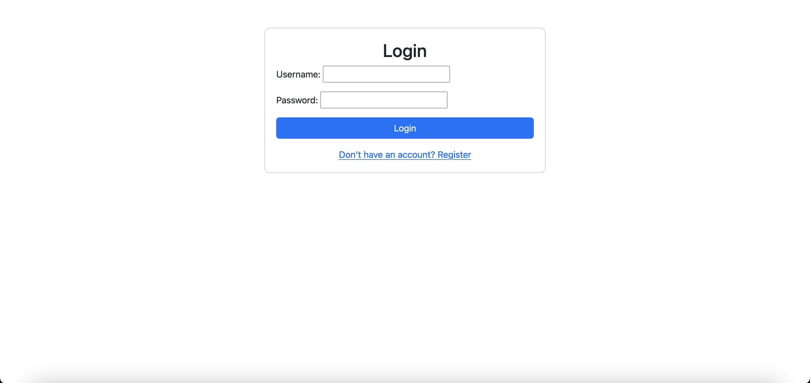

# Django Login Page Demo

This is a simple Django-based login and registration system with a responsive UI using Bootstrap and custom CSS. It demonstrates user authentication, including registration, login, and logout functionality.

  

## Features

- User registration
- User login
- User logout
- Secure views for authenticated users
- Bootstrap-based responsive design

## Requirements

- Python 3.6+
- Django 4.2.13+
- Bootstrap (CDN)

## Setup

Follow these steps to get the project up and running on your local machine:

### 1. Clone the Repository

```bash
git clone https://github.com/yourusername/django-login-demo.git
cd django-login-demo
```

### 2. Create a Virtual Environment

```bash
python3 -m venv env
source env/bin/activate
```

On Windows, use:

```bash
env\Scripts\activate
```

### 3. Install Dependencies

```bash
pip install -r requirements.txt
```

If `requirements.txt` is not available, manually install Django:

```bash
pip install django
```

### 4. Apply Migrations

```bash
python manage.py migrate
```

### 5. Create a Superuser

```bash
python manage.py createsuperuser
```

Follow the prompts to create an admin user.

### 6. Run the Development Server

```bash
python manage.py runserver
```

Visit [http://127.0.0.1:8000](http://127.0.0.1:8000) in your web browser.

## Directory Structure

```
django-login-demo/
│
├── manage.py
├── myproject/
│   ├── __init__.py
│   ├── settings.py
│   ├── urls.py
│   ├── wsgi.py
│
├── myapp/
│   ├── __init__.py
│   ├── admin.py
│   ├── apps.py
│   ├── models.py
│   ├── tests.py
│   ├── views.py
│   ├── migrations/
│       ├── __init__.py
│
├── templates/
│   ├── register.html
│   ├── login.html
│   ├── home.html
│
└── static/
    ├── css/
        ├── style.css
```

## Usage

- **Register:** Create a new account.
- **Login:** Log in with your credentials.
- **Home:** Access the home page after logging in.
- **Logout:** Log out from the system.

## Configuration

### `myproject/settings.py`

Ensure you have the following in your settings:

```python
INSTALLED_APPS = [
    ...
    'django.contrib.admin',
    'django.contrib.auth',
    'django.contrib.contenttypes',
    'django.contrib.sessions',
    'django.contrib.messages',
    'django.contrib.staticfiles',
    'myapp',  # Add your app here
]

MIDDLEWARE = [
    ...
    'django.middleware.security.SecurityMiddleware',
    'django.contrib.sessions.middleware.SessionMiddleware',
    'django.middleware.common.CommonMiddleware',
    'django.middleware.csrf.CsrfViewMiddleware',
    'django.contrib.auth.middleware.AuthenticationMiddleware',
    'django.contrib.messages.middleware.MessageMiddleware',
    'django.middleware.clickjacking.XFrameOptionsMiddleware',
]

TEMPLATES = [
    {
        ...
        'OPTIONS': {
            'context_processors': [
                ...
                'django.template.context_processors.request',
                'django.contrib.auth.context_processors.auth',
                'django.contrib.messages.context_processors.messages',
            ],
        },
    },
]
```

### URL Configuration

#### `myproject/urls.py`

```python
from django.contrib import admin
from django.urls import path, include

urlpatterns = [
    path('admin/', admin.site.urls),
    path('', include('myapp.urls')),  # Include app URLs
]
```

#### `myapp/urls.py`

```python
from django.urls import path
from . import views

urlpatterns = [
    path('', views.index_view, name='index'),
    path('register/', views.register_view, name='register'),
    path('login/', views.login_view, name='login'),
    path('logout/', views.logout_view, name='logout'),
    path('home/', views.home_view, name='home'),
]
```

## License

This project is licensed under the Creative Commons Zero Universal License, so edit and use to your heart's content! See the [LICENSE](LICENSE) file for details.
